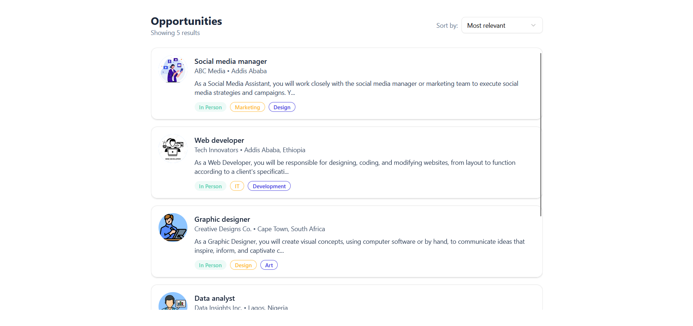
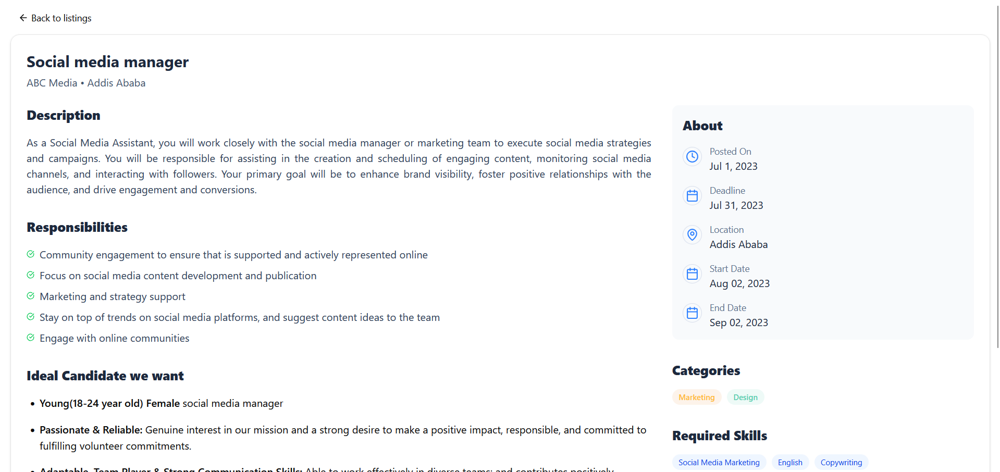

# 💼 Job Listing App

🔗 **Live Demo:** [https://job-listing-app-dummy-data-azp6.vercel.app/](https://job-listing-app-dummy-data-azp6.vercel.app/)

A sleek, modern **Next.js** web application for showcasing job opportunities.  
It uses **dummy data**, modern styling with **Tailwind CSS** and **shadcn/ui**, and follows best practices for scalable and clean code architecture.

🎨 [View Figma Prototype](https://www.figma.com/file/igmFo7dypzpuM02KJi8cay/Task-1?type=design&node-id=0%3A1&mode=design&t=FUZyVfl0w887g31l-1)

---

## 🧠 Features

-   ✅ Dynamic job listings and detail pages
-   ❌ Graceful "Job Not Found" fallback
-   💅 UI built with `shadcn/ui` and `Tailwind CSS`
-   🔁 Dummy data sourced from a local TypeScript file
-   ⚡ Fast, optimized Next.js routing and rendering

---

## 📦 Tech Stack

-   **Framework**: [Next.js](https://nextjs.org/)
-   **Styling**: [Tailwind CSS](https://tailwindcss.com/), [shadcn/ui](https://ui.shadcn.com/)
-   **Language**: TypeScript

---

## 📁 Dummy Data

All job-related content is stored statically in: `src/data/jobs.ts`

## 🖼️ Screenshots

### 🏠 Home – Job Listings (`/`)

Displays all available jobs using cards or lists.

---

### 📋 Job Details (`/jobs/[id]`)

Displays detailed information about a single job.

---

### 🚫 Job Not Found (`/jobs/[invalid-id]`)

Displays a user-friendly message when the job ID is invalid or doesn't exist.

---
