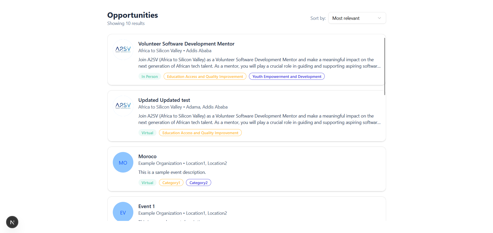
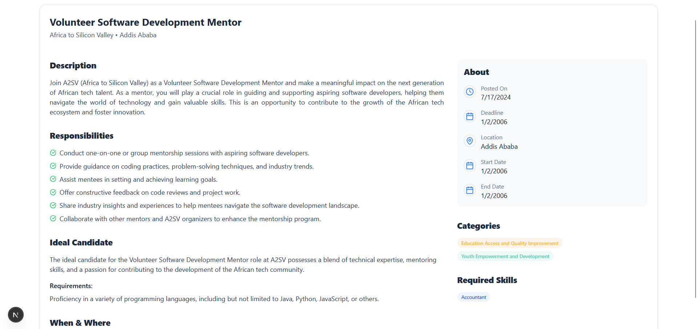
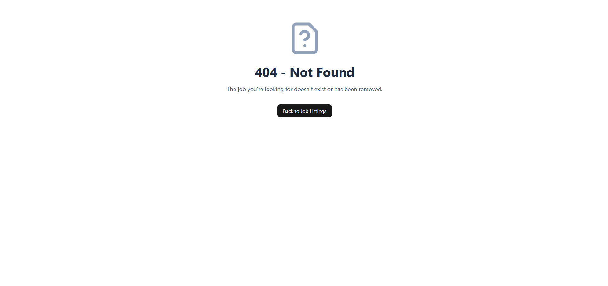
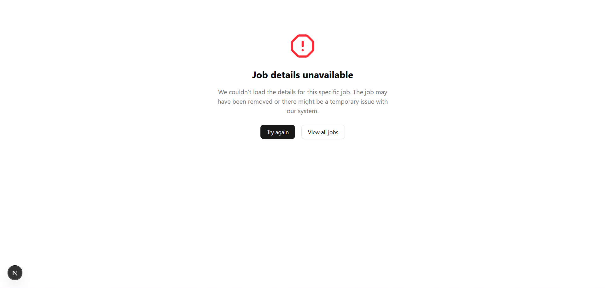
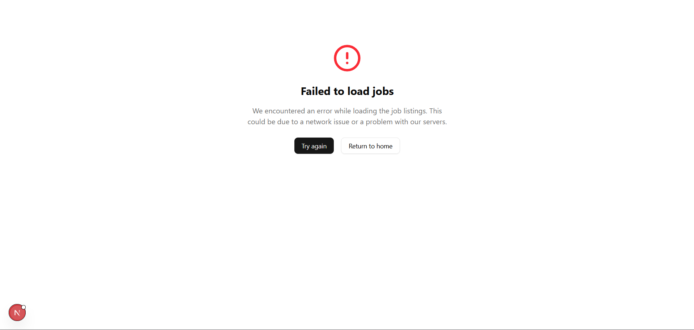
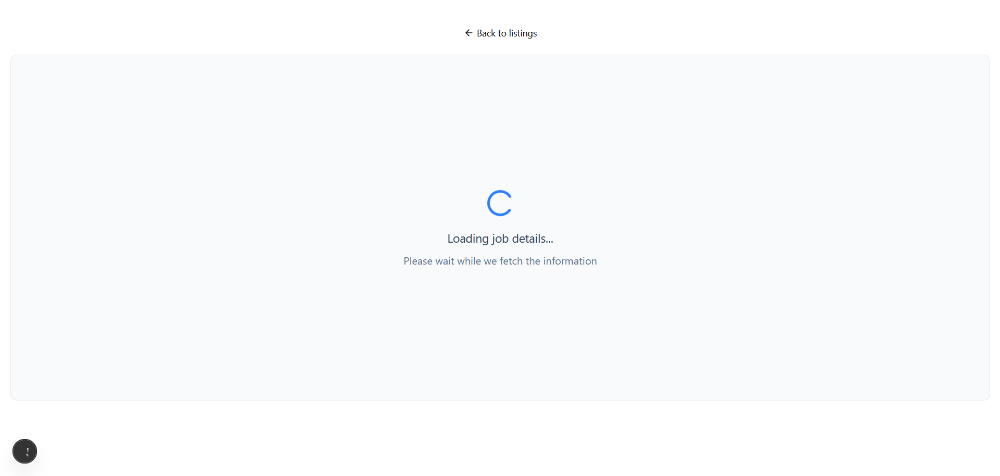
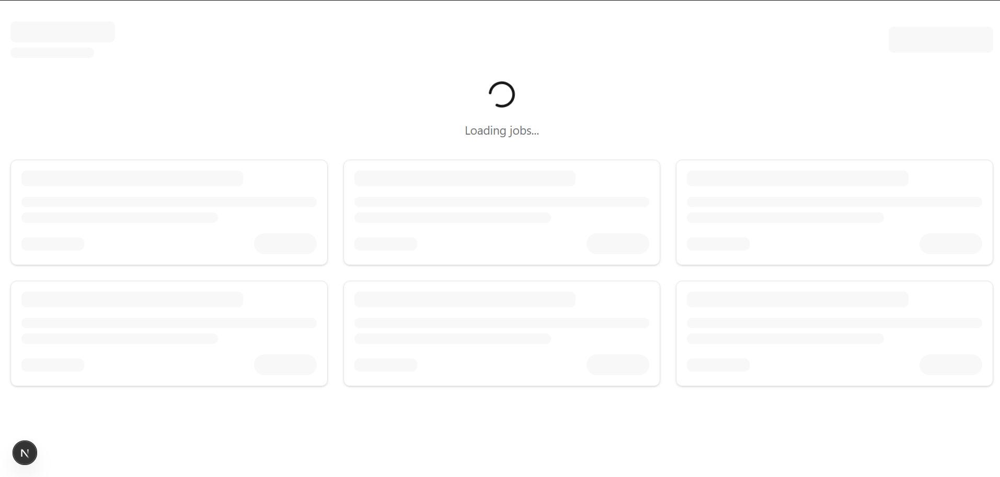

# 💼 Job Listing App

🔗 **Live Demo:** [https://job-listing-app-dummy-data-azp6.vercel.app/](https://job-listing-app-dummy-data-azp6.vercel.app/)

A sleek, modern **Next.js** web application for showcasing job opportunities. It now uses **real data from the AKIL backend**, implements efficient data fetching with **React Query**, and features modern styling with **Tailwind CSS** and **shadcn/ui**, all following best practices for scalable and clean code architecture.

🎨 [View Figma Prototype](https://www.figma.com/file/igmFo7dypzpuM02KJi8cay/Task-1?type=design&node-id=0%3A1&mode=design&t=FUZyVfl0w887g31l-1)

---

## 🧠 Features

-   ✅ Dynamic job listings and detail pages
-   ✅ Real-time data from AKIL backend API
-   ✅ Efficient data fetching and caching with React Query
-   ❌ Graceful error handling and loading states
-   💅 UI built with `shadcn/ui` and `Tailwind CSS`
-   ⚡ Fast, optimized Next.js routing and rendering

---

## 📦 Tech Stack

-   **Framework**: [Next.js](https://nextjs.org/)
-   **Data Fetching**: [React Query](https://tanstack.com/query/latest) for efficient API integration
-   **Styling**: [Tailwind CSS](https://tailwindcss.com/), [shadcn/ui](https://ui.shadcn.com/)
-   **Language**: TypeScript

---

## 🔌 Backend Integration

The application now connects to the AKIL backend API for real job data. To configure the backend connection:

1. Create a `.env` file in your project root
2. Add the backend URL as shown in the `.env.example` file:
    ```
    NEXT_PUBLIC_API_URL=https://akil-backend-url.com/api
    ```

## ⚡ React Query Implementation

The app leverages React Query for data fetching, which provides:

-   Automatic caching of API responses
-   Background data refreshing
-   Loading and error states management
-   Reduced network requests
-   Improved user experience with instant data availability

---

## 🖼️ Screenshots

### 🏠 Home – Job Listings (`/`)

Displays all available jobs using cards or lists.



---

### 📋 Job Details (`/jobs/[id]`)

Displays detailed information about a single job.



---

### 🚫 Job Not Found (`/jobs/[invalid-id]`)

Displays a user-friendly message when the job ID is invalid or doesn't exist.



---

### ⚠️ Error Pages

The application handles various error states gracefully.




---

### ⏳ Loading States

Smooth loading transitions when fetching data from the backend.



