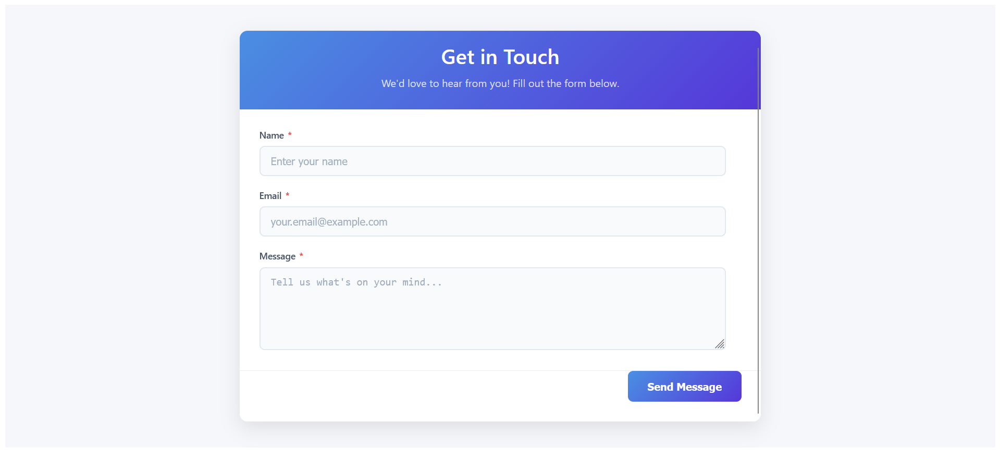
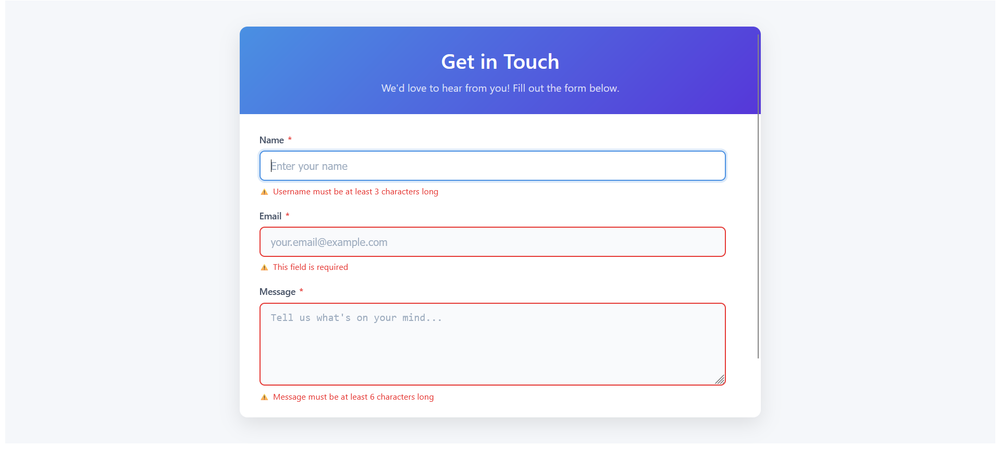

# 📬 Contact Form App

A simple and elegant contact form built with **React**, styled using **CSS Modules**, and validated using **React Hook Form** with **Zod** schemas.

## 🧰 Tech Stack

-   ⚛️ React + TypeScript
-   🎣 React Hook Form
-   📦 Zod (for schema validation)
-   💅 CSS Modules
-   ⚡ Vite (for fast builds)

---

## 🚀 Features

-   Real-time form validation
-   Schema-based validation with Zod
-   Styled components using CSS Modules
-   Success confirmation popup
-   Clear and accessible error messages

---

## 🗂️ Folder Structure

```bash
src/
├── components/
│   └── contact-form.tsx        # Main contact form component
├── schemas/
│   └── contact-form.schema.ts  # Zod schema for form validation
├── styles/
│   └── contact-form.module.css # Styles for the form
├── App.tsx
├── main.tsx
└── vite-env.d.ts
```

---

## 📸 Screenshots

### 🖼️ General UI



---

### ❌ Validation Errors



---

### ✅ Success Popup


---

## 🧪 Running the App Locally

```bash
# Clone the repo
git clone https://github.com/MarouaneBenbetka/Code-Quest-Archive.git
cd web/React/react-hook-form-practice

# Install dependencies
npm install

# Start development server
npm run dev
```

Open [http://localhost:5173](http://localhost:5173) to view it in the browser.

---
