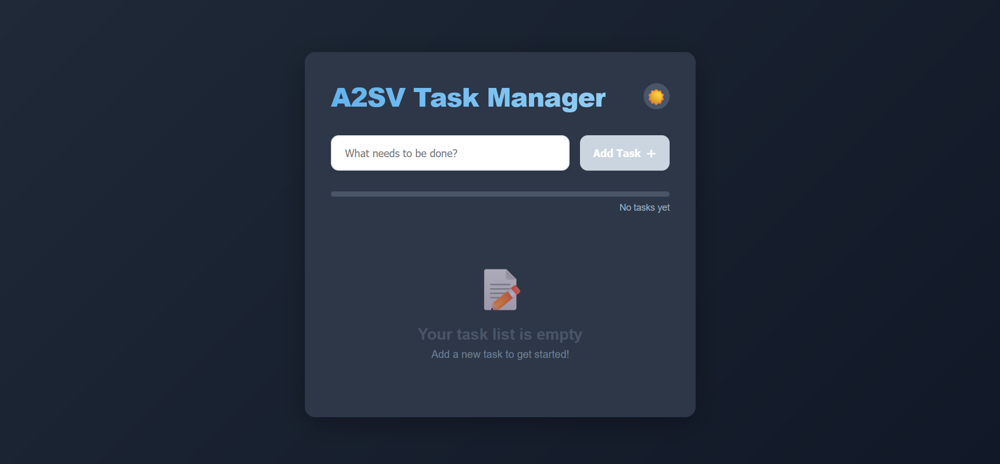
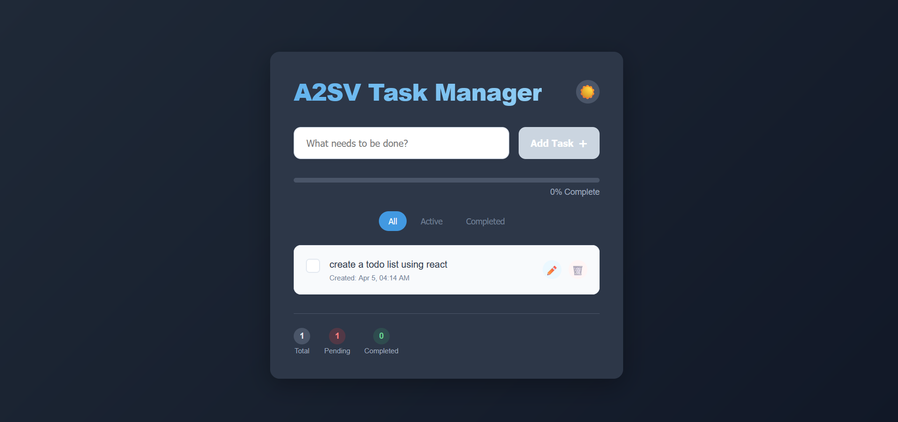
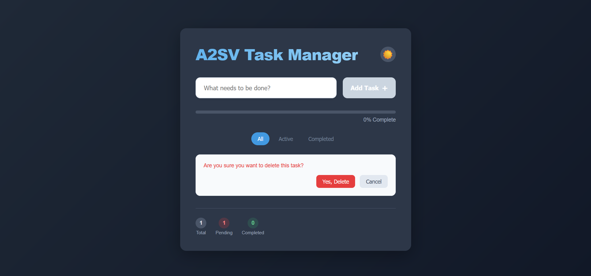
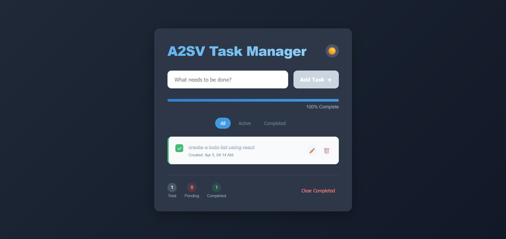
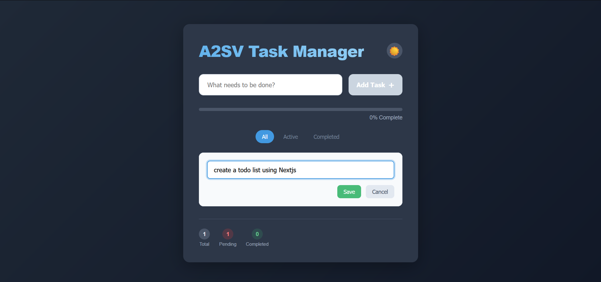
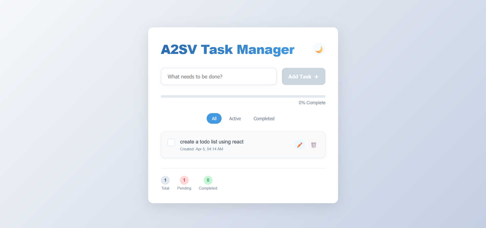

# 📌 Todo List App

🔗 **Live Demo:** [https://todo-list-react-three-beige.vercel.app/](https://todo-list-react-three-beige.vercel.app/)

A simple, efficient, and elegant Todo List application built with **React**, **TypeScript**, and **Vite**.  
Manage your daily tasks easily with functionalities such as adding, editing, deleting, and marking tasks as completed. It also supports **dark mode** for comfortable use in low-light conditions.

---

## 🚀 Technologies Used

-   **React** ⚛️
-   **TypeScript** 📘
-   **Vite** ⚡
-   **CSS Modules** 🎨

---

## 📁 Project Structure

```bash
src/
├── components/
│   ├── todo-form.tsx
│   ├── todo-item.tsx
│   └── todo-list.tsx
│
├── styles/
│   ├── app.module.css
│   ├── index.css
│   ├── todo-form.module.css
│   ├── todo-item.module.css
│   └── todo-list.module.css
│
├── types/
│   └── todo.ts
│
├── App.tsx
└── main.tsx
```

---

## ✅ Features

-   [x] **Add Tasks**: Quickly add tasks with a user-friendly interface.
-   [x] **Edit Tasks**: Easily update or edit existing tasks.
-   [x] **Delete Tasks**: Remove tasks you no longer need.
-   [x] **Complete Tasks**: Mark tasks as completed to track progress.
-   [x] **Dark Mode**: Switch effortlessly between dark and light themes.

---

## 🖥️ UI Screenshots

| General UI                                         | Adding a Task                                        |
| -------------------------------------------------- | ---------------------------------------------------- |
|  |  |

| Deleting a Task                                          | Completing Tasks                                             |
| -------------------------------------------------------- | ------------------------------------------------------------ |
|  |  |

| Editing a Task                                         | White Mode                                         |
| ------------------------------------------------------ | -------------------------------------------------- |
|  |  |

---

## 💻 Installation

Follow these steps to run the app locally:

```bash
# Clone the repository
git clone https://github.com/MarouaneBenbetka/Code-Quest-Archive.git

# Navigate to project directory
cd web/React/todo-list-react

# Install dependencies
npm install

# Run development server
npm run dev
```

---
