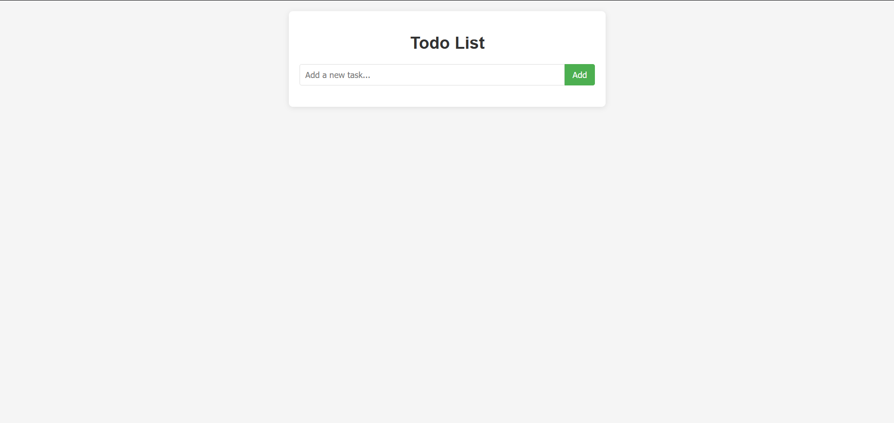
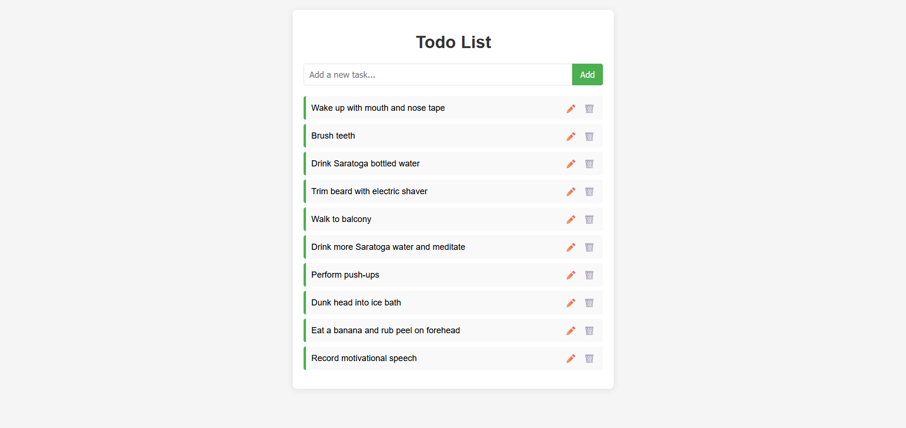
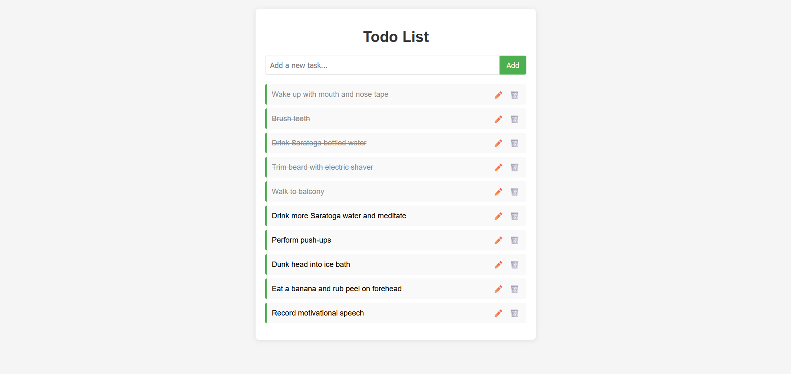
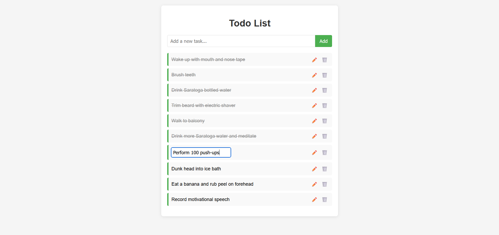

# Todo List Application

🔗 **Live Demo:** [https://todo-list-ts-gules.vercel.app/](https://todo-list-ts-gules.vercel.app/)

A web-based Todo List application built with HTML, CSS, and TypeScript. This application allows users to add, edit, complete, and delete tasks. All tasks are stored in the browser's localStorage, so they persist even when the page is refreshed.

## Features

-   Add new tasks
-   Mark tasks as complete (click on the task text)
-   Edit existing tasks (click on the pencil icon)
-   Delete tasks (click on the trash icon)
-   Persistent storage using localStorage
-   Responsive design
-   TypeScript implementation for type safety and better code organization

## Screenshots

### Main Application Interface


_The main interface of the Todo List application showing the input field and task list._

### Task List with Items


_The Todo List with several tasks added._

### Completed Task


_A task marked as completed, showing the strikethrough style._

### Editing a Task


_Editing an existing task using the inline edit functionality._

## Prerequisites

-   [Node.js](https://nodejs.org/) (for TypeScript compilation)
-   [TypeScript](https://www.typescriptlang.org/) (`npm install -g typescript`)
-   [Visual Studio Code (VS Code)](https://code.visualstudio.com/)
-   [Live Server Extension](https://marketplace.visualstudio.com/items?itemName=ritwickdey.LiveServer)

## How to Run

1. Clone this repository:

    ```
    git clone https://github.com/MarouaneBenbetka/Code-Quest-Archive.git
    ```

2. Navigate to the project directory:

    ```
    cd web/TS/todo-list-app/src
    ```

3. Install TypeScript if you haven't already:

    ```
    npm install -g typescript
    ```

4. Compile the TypeScript code:

    ```
    tsc
    ```

    Or, if you want to watch for changes during development:

    ```
    tsc --watch
    ```

5. Open the Project in VS Code

6. Install Live Server (if not installed)

7. Open `index.html`

8. Run with Live Server
   Right-click on the `index.html` file and select **"Open with Live Server"**.  
   This will open your default web browser and load the page on a local server (usually `http://127.0.0.1:5500`).

## Implementation Details

-   The application is built using TypeScript for enhanced type safety and better code organization.
-   It follows a modular architecture with clear separation of concerns:
    -   **Task Interface**: Defines the structure of task objects
    -   **TaskService**: Handles data operations and localStorage interactions
    -   **TodoUIController**: Manages the DOM and user interactions
    -   **TodoApp**: Main application class that ties everything together
-   Tasks are stored in the browser's localStorage for persistence.
-   CSS is used for styling and responsive design.
-   The codebase follows modern TypeScript and JavaScript practices.

## Future Improvements

-   Add due dates for tasks
-   Implement task categories or tags
-   Add task priority levels
-   Implement drag-and-drop for reordering tasks
-   Add dark mode toggle
-   Add unit tests for TypeScript classes
-   Implement filtering and sorting options
